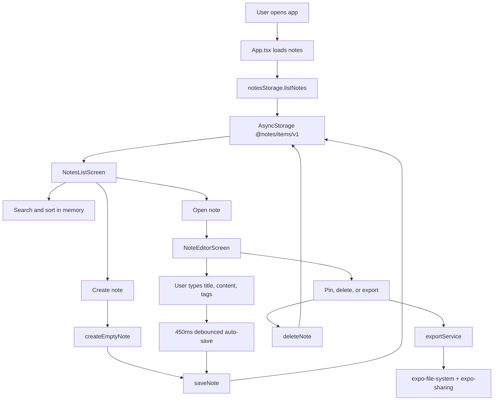

# Notes

A clean, offline-first mobile notes app built with React Native and Expo. It supports creating, editing, deleting, searching, sorting, pinning, tagging, markdown preview, dark mode, and exporting notes as text files.

## Setup

```bash
npm install
npm start
```

Run on a device or simulator:

```bash
npm run android
npm run ios
```

Type-check the project:

```bash
npm run typecheck
```

## File Structure

```text
App.tsx                         App shell, navigation state, note actions
src/components/                 Reusable UI building blocks
src/screens/                    Notes list and note editor screens
src/services/exportService.ts   Text export/share flow
src/storage/notesStorage.ts     AsyncStorage persistence layer
src/theme/theme.ts              Light and dark theme tokens
src/types/note.ts               Shared note data types
src/utils/                      Date, filtering, sorting, tag helpers
```

## Architecture Flow



## Data Model

```ts
type Note = {
  id: string;
  title: string;
  content: string;
  tags: string[];
  createdAt: number;
  updatedAt: number;
  pinned: boolean;
};
```

## Design Decisions

- Expo React Native keeps Android and iOS support simple while remaining production-friendly.
- AsyncStorage is used because the app data model is small, local, and offline-first.
- The app keeps navigation lightweight with local state instead of adding a navigation library for two screens.
- Auto-save is debounced to avoid excessive storage writes while preserving changes quickly.
- Markdown support is intentionally basic and dependency-free: headings, bold text, and unordered lists.
- Pinned notes are always sorted above unpinned notes, then ordered by the selected date mode.

## Contributors

- [mallareddygariharikareddy](https://github.com/mallareddygariharikareddy)
